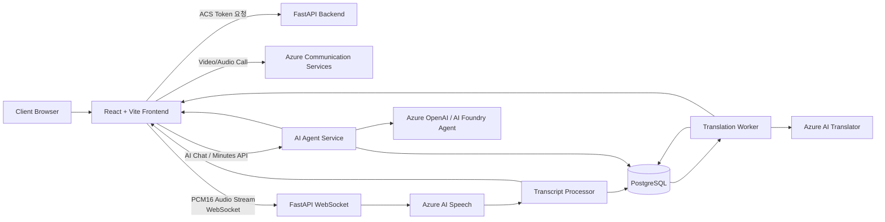
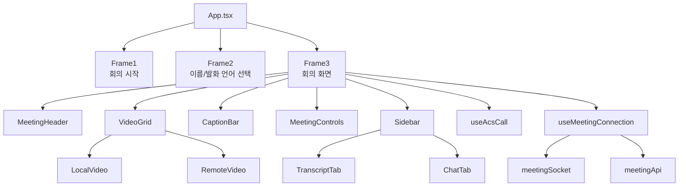
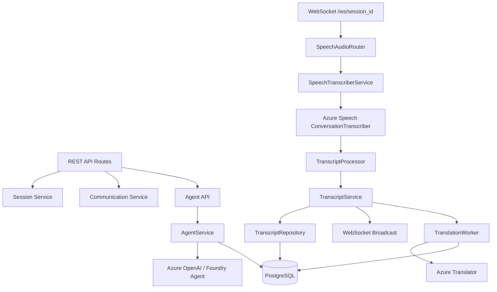
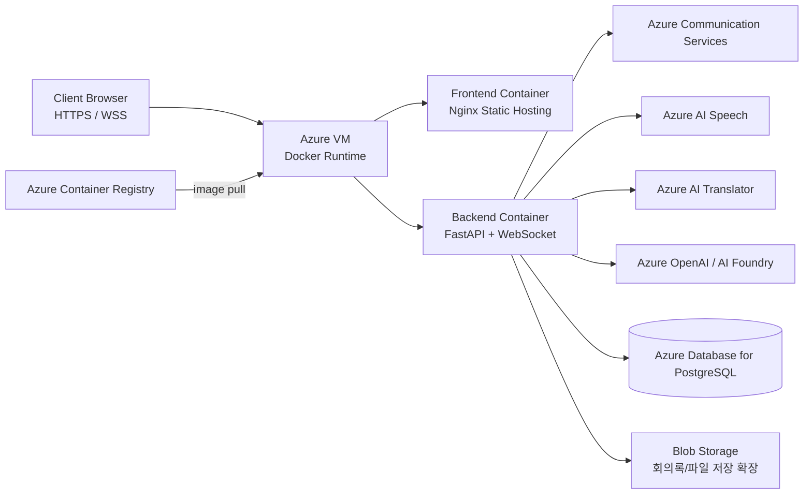
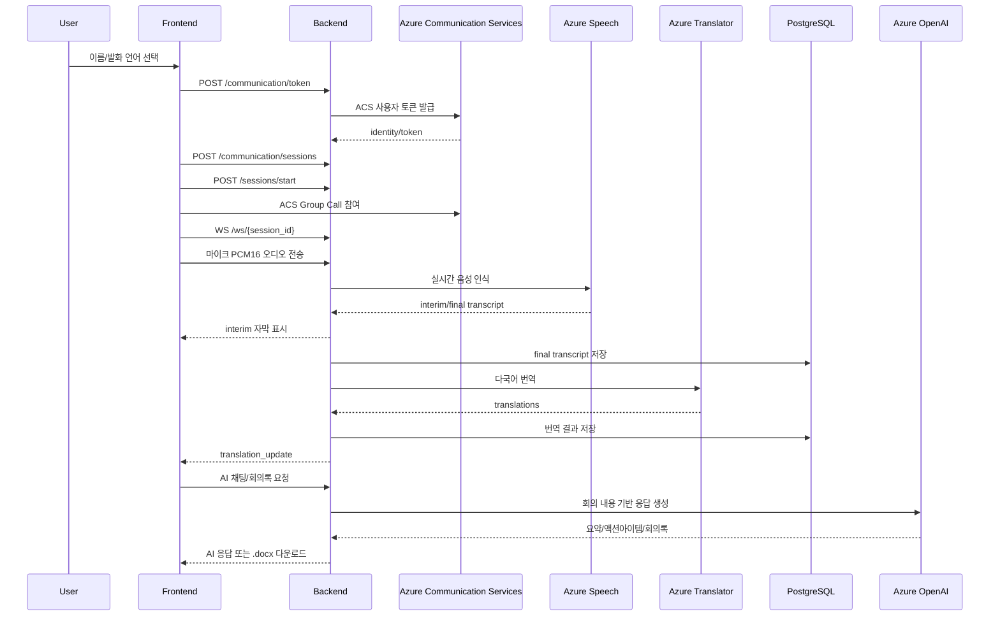

# AI 다국어 회의 플랫폼

Azure Communication Services와 Azure AI를 기반으로 한 실시간 다국어 화상회의 플랫폼입니다. 브라우저에서 회의에 참여하면 음성을 실시간으로 텍스트화하고, 한국어·영어·일본어·중국어 번역 기록을 제공하며, 회의 종료 후 AI 요약과 회의록 다운로드까지 지원합니다.

## Project Overview

비대면 회의가 일상화되면서 언어 장벽, 회의 내용 누락, 회의록 수기 작성 부담이 계속 발생합니다. 이 프로젝트는 화상회의, 실시간 STT, 자동 번역, AI 회의 어시스턴트를 하나의 업무용 플랫폼으로 연결해 회의 중에는 이해를 돕고, 회의 후에는 후속 업무 정리를 자동화하는 것을 목표로 합니다.

## Team

| 이름 | 역할 |
| --- | --- |
| 신재우 | 프론트엔드 |
| 양서윤 | 인프라 |
| 이소윤 | 백엔드, AI |
| 이수림 | 백엔드, AI |
| 한소연 | 백엔드, AI |

프로젝트 기간: `2026-06-24` ~ `2026-07-08`

## Core Features

| 기능 | 설명 |
| --- | --- |
| 실시간 화상회의 | Azure Communication Services Calling SDK 기반 그룹 콜 |
| 실시간 AI 자막 | 브라우저 마이크 오디오를 WebSocket으로 전송하고 Azure Speech로 전사 |
| 다국어 번역 | 최종 자막을 Azure Translator로 한국어·영어·일본어·중국어 번역 |
| 실시간 기록 | 회의 중 확정된 발화 원문과 번역을 사용자별 기록으로 표시 |
| AI 채팅 | 저장된 회의 자막을 기반으로 질의응답, 키워드 검색, 요약 제공 |
| AI 회의록 | 회의 요약, 의사결정, 액션 아이템을 생성하고 `.docx`로 다운로드 |
| 세션 관리 | `meeting_id`, `session_id` 기준 회의 시작/종료와 참가자 메타데이터 관리 |

## Service Architecture



## Frontend Architecture



## Backend Architecture



## Infra Architecture



## Repositories

| 영역 | 설명 |
| --- | --- |
| `meeting-fe` | React + Vite 기반 프론트엔드 |
| `meeting-be` | FastAPI 기반 백엔드, STT/번역/AI Agent API |
| Infra | Docker, Nginx, Azure VM, ACR, PostgreSQL, Azure AI 서비스 연동 |

## Tech Stack

| 구분 | 기술 |
| --- | --- |
| Frontend | React, Vite, TypeScript, Tailwind CSS, Azure Communication Calling SDK, WebSocket |
| Backend | FastAPI, Python, SQLAlchemy, WebSocket, Azure Speech SDK |
| AI | Azure AI Speech, Azure AI Translator, Azure OpenAI, Azure AI Foundry Agent |
| Database | PostgreSQL, Azure Database for PostgreSQL Flexible Server |
| Infra | Docker, Nginx, Azure VM, Azure Container Registry |

## Main Flow



## API Summary

| Method | Path | 설명 |
| --- | --- | --- |
| `POST` | `/communication/token` | ACS 사용자 토큰 발급 |
| `POST` | `/communication/sessions` | ACS 회의 세션 생성 |
| `POST` | `/sessions/start` | 회의/STT 세션 시작 |
| `POST` | `/sessions/stop/{session_id}` | 회의/STT 세션 종료 |
| `WS` | `/ws/{session_id}` | 브라우저 오디오 스트림 및 실시간 자막 |
| `GET` | `/transcripts?session_id=...` | 저장된 회의 자막 조회 |
| `POST` | `/agent/sessions/{session_id}/query` | AI 채팅 질의 |
| `GET` | `/agent/sessions/{session_id}/summary` | 회의 요약 조회/생성 |
| `GET` | `/agent/sessions/{session_id}/minutes/download` | 회의록 `.docx` 다운로드 |

## Frontend Setup

```bash
npm install
npm run dev
```

필수 환경 변수:

```env
VITE_API_BASE_URL=http://127.0.0.1:8000
VITE_WS_BASE_URL=ws://127.0.0.1:8000
VITE_USE_MOCK=false
```

프로덕션 빌드:

```bash
npm run build
```

## Backend Setup

```bash
python -m venv .venv
source .venv/bin/activate
pip install -r requirements.txt
uvicorn main:app --reload
```

주요 환경 변수:

```env
POSTGRES_URL=
ACS_CONNECTION_STRING=
SPEECH_KEY=
SPEECH_REGION=
TRANSLATOR_KEY=
TRANSLATOR_REGION=
AZURE_OPENAI_ENDPOINT=
AZURE_OPENAI_API_KEY=
AZURE_OPENAI_DEPLOYMENT=
```

## Demo Scenario

1. 브라우저에서 `/?room=a`로 접속합니다.
2. 이름과 참여자 발화 언어를 선택합니다.
3. 회의에 입장하면 ACS 영상회의가 시작됩니다.
4. 발화가 들어오면 하단 AI 자막에 원문이 실시간 표시됩니다.
5. 문장이 확정되면 오른쪽 실시간 기록 탭에 원문과 번역이 저장됩니다.
6. AI 채팅 탭에서 “회의록 요약해줘”처럼 질문합니다.
7. 헤더의 회의록 버튼으로 `.docx` 회의록을 다운로드합니다.

## Development Notes

- `meeting_id`는 회의방 ID이며 ACS Group ID와 AI 채팅/회의록 조회 기준으로 사용합니다.
- `session_id`는 사용자 접속 단위 세션이며 WebSocket 연결과 세션 종료에 사용합니다.
- 실시간 하단 자막은 `interim` transcript를 표시하고, DB 저장은 `final` transcript만 수행합니다.
- 같은 `room` 값을 반복 사용하면 이전 회의 DB 기록이 AI 요약/회의록에 섞일 수 있습니다.
- 실제 백엔드를 사용할 때는 프론트 환경 변수 `VITE_USE_MOCK=false`가 필요합니다.
- 마이크 권한, ACS 토큰 형식, FastAPI 서버 재시작 여부는 음성 인식/영상회의 문제 발생 시 먼저 확인합니다.

